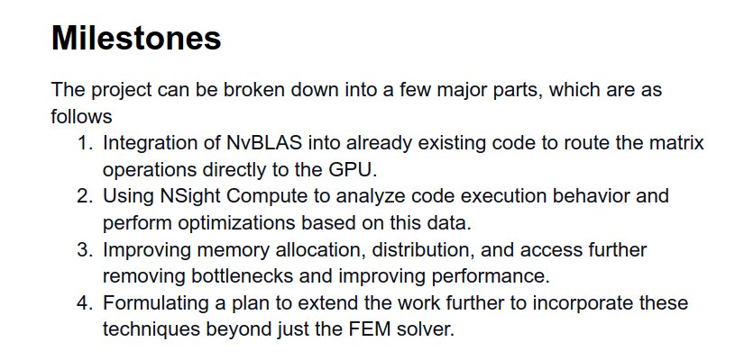
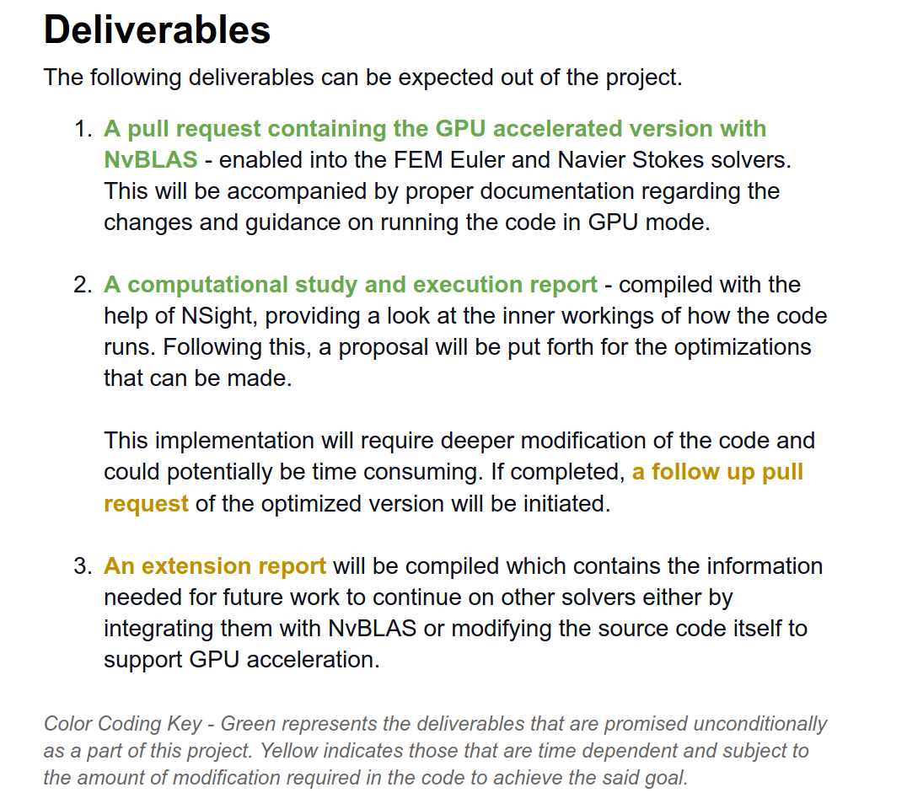
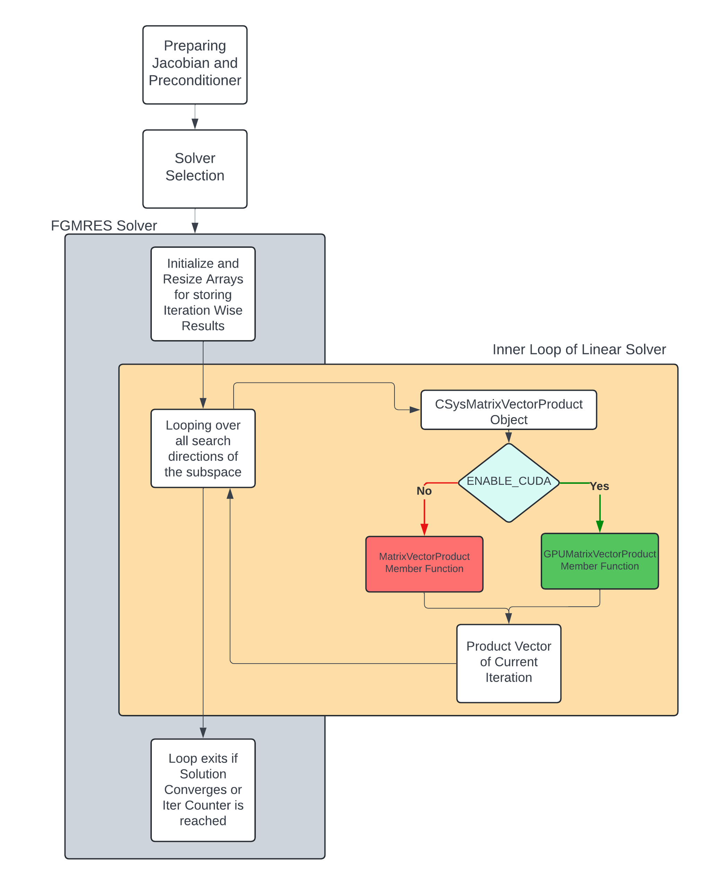
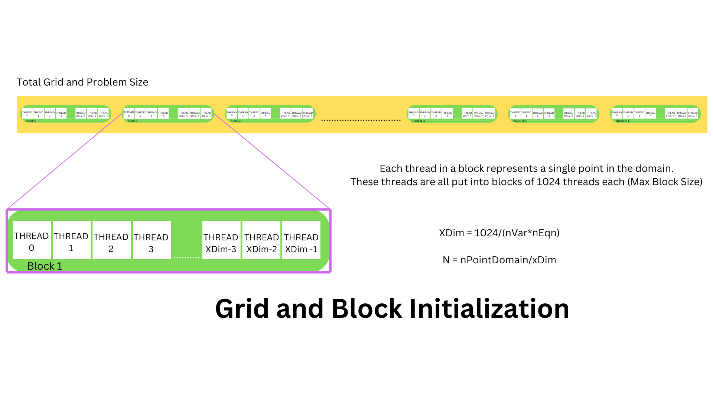
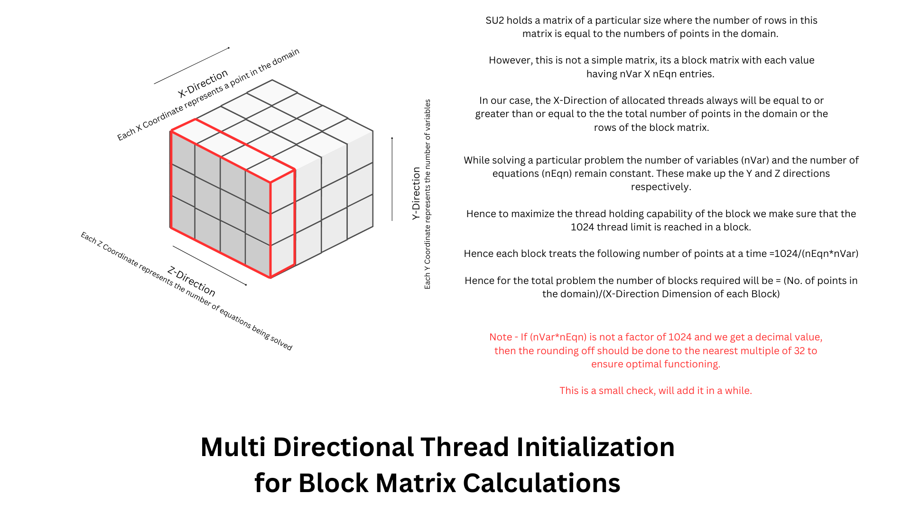
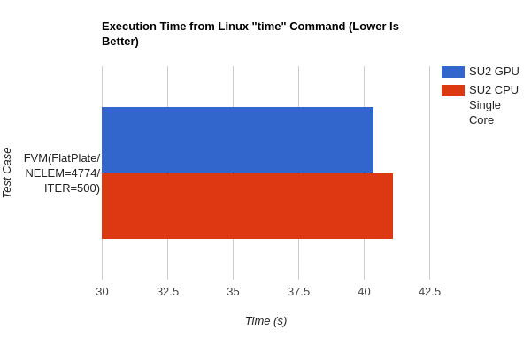
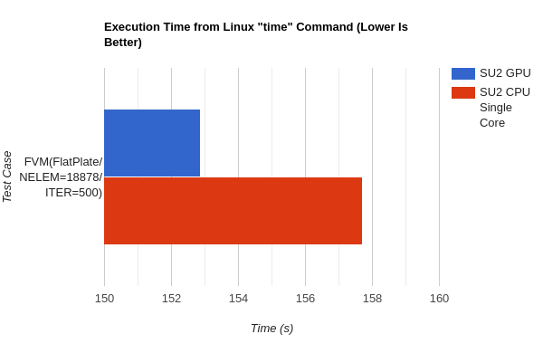
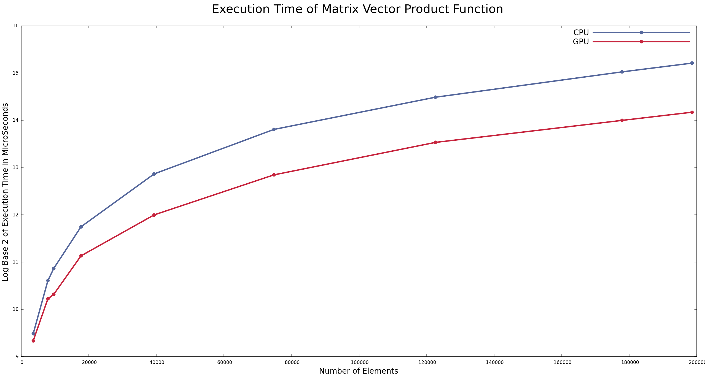

# Google Summer of Code '24 Project - Feasibility of GPU Acceleration in SU2

*This repo does not contain the work done during the project. It contains the assignment, tasks and studies done during the proposal period and the link to the actual project repo along with the full report given below.*

## LINK TO REPO WITH FULL SOURCE CODE, COMMIT AND DIFF HISTORY - [https://github.com/areenraj/SU2_GSoC_GPU.git](https://github.com/areenraj/SU2_GSoC_GPU.git) AND THE PULL REQUEST - [PR #2346](https://github.com/su2code/SU2/pull/2346) 

The linked code repository contains a version of the SU2 codebase that has CUDA support enabled for offloading particular linear algebra options to the GPU. The current implementations show promise for increased performance with further optimizations and changes. We are also currently working in a new research direction as will be outlined further below.

## Compiling and Running the Code

### Compiling
Currently two modifications exist in the code
- NVBLAS Integration which intercepts calls for the Space Integration in the DG Solver - not very useful
- Acceleration of program wide Matrix Vector Product by outsourcing to a CUDA Kernel

Both can be enabled by giving meson the following option during compilation
```
-Denable-cuda=true
```

You will also need to specify the environment variable CUDA_PATH with the location of the installed CUDA Folder - usually found in the /usr/local directory

A script has been provided which allows you to input your specific paths and use to compile. **We recommend not using MPI currently** as splitting up chunks of the domain will cause issues with predefined memory transfer (that's not good, I know, I'll fix it)

To run the script just go 
```
bash build_SU2.sh
```
A barebones template NVBLAS config file has also been provided for reference.

### Usage

To start the use of the GPU in any simulation involving the FGMRES solver. Just set the following keyword in the config file to YES

```
ENABLE_CUDA=YES
```

Error handling is done by an Error Check Wrapper and should provide exit codes at the file and line of the anomaly.

### Benchmarking

To benchmark the individual member functions, the following sections of code in the CMatrixVectorProduct.hpp file have to be added.

```

   std::ofstream serial;

   auto start = std::chrono::high_resolution_clock::now(); 

   ![[FUNCTION_TO_BE_BENCHMARKED]]!

   auto stop = std::chrono::high_resolution_clock::now();
   auto duration = std::chrono::duration_cast<std::chrono::microseconds>(stop - start);

   double time = duration.count();

   serial.open("MVP_Exec_Time.txt", std::ios::app);
   serial << time << "\n";
   serial.close();

```
and the following headers added to the same file
```
#include <fstream>
#include <chrono>
#include <time.h>
#include <iostream>
```

This will create a file named MVP_Exec_Time.txt which contains the execution time in microseconds. Always remove or delete the file before starting another run or else the new times will get appended onto it.

Also it is recommended to disable GPU Error Check functions before starting as this may cause excessive overhead in execution. These may be removed from the GPU_lin_alg.cu and CSysMatrix.cpp files.

## Initial Proposal and Deliverables

This section outlines the original plan of the project and the changes that were made throughout the course of its duration.

Initially we decided to approach the addition of GPU functionality to SU2 using the NVBLAS framework. Since the FEM solver used level 3 BLAS calls which can be intercepted by the NVBLAS library directly and routed to the GPU if it is deemed that the  particular call would execute faster on the GPU. 

Our proposed milestones were the implementation and further optimization of this approach.



After creating an NVBLAS enabled version of the code, our investigation revealed that the BLAS calls are made only during the Space Integration subroutine that would not give us a sizeable speedup in the code. 

The major chunk of linear algebra operations happens while using an implicit time scheme that involves solving a matrix system. This Time Integration subroutine is also one of the most computationally intensive sections of the code.

## Pivoting to a more Practical Approach

This is the reason that the NVBLAS integration did not offer a path of execution that could provide considerable speed up to our execution time. Therefore, we chose to switch our focus to a more impactful implementation by directly working on the linear solvers that handle the Matrix operations in the Time Integration subroutine.

This would

- Offer a bigger overall boost to the performance of the code as we would be targetting a critical area 
- Automatically extend this endeavor to other solvers, not only fulfilling the fourth milestone, but also being a wide-reaching solution.

**We took this decision keeping in mind that the Summer of Code program is not geared towards only fulfilling deliverables and keeping in line with timelines. But that it serves the overall goal of writing more useful code that has a bigger effect.**



- An NVBLAS integrated version was successfully created by linking the necessary library into the code
- Acceleration of the program was made possible by outsourcing Matrix-Vector Products usinga a CUDA kernel
- This file serves as the execution + extension report that is mentioned above. NSight tools were used to profile the code as initially proposed 
  
## Current Implementation

For the working problem, we have focused on two aspects of the solving algorithm

- The FGMRES solver that heavily relies on Matrix-Vector Products
- Owing to the above point, we modify the matrix vector product class and functions

A flowchart of the current algorithm that we use is presented below. 







The GPUMatrixVectorProduct Member Function belongs to the CSysMatrix Class

- The function makes cudaMalloc and cudaMemcpy API calls to transfer the participating matrix and vector data to the GPU
- The GPUMatrixVectorProductAdd kernel is launched which multiplies the block matrix with the vector using CUDA
- The data of the Product Vector is transferred back to the CPU and the device pointers are freed

## Code Profiling

Using NSight Systems, we can get the analysis of the implementation. This profiling was done for the flat plate case in the FVM NSS Solver with the number of elements being 4096.


As expected, the memory transfer between the host and device comprises of the main downtime in this implementation (2.315 ms per call). The Kernel launch itself is only 0.014 ms long. 

## Results

All benchmarks are done without GPU error checking as it adds a considerable overhead to the entire operation. They are also all done in debug mode of the code to make sure that the correct functions were being called.

The following results were done with increasing mesh density for the flatplate case.


 
 

It is promising to see that even with a preliminary algorithm the GPU implementation manages to break out ahead of the single core CPU one. Comparisons between the total execution time for a larger number of cases is shown as below


Even with increasing problem size the GPU implementation scales well enough to stay ahead of the CPU one although marginally.

The time taken to execute only the CPU and GPU member functions were measured. In this case, the GPU implementation is over twice as fast as its CPU counterpart. The following log scale graph is representative of that



The GPU member function consistently outperforms the CPU one by a considerable margin.

## Moving Forward

If the number of the repeated memory transfers can be reduced then we can gain a considerable boost as cudaMemcpy is invoked per call. The individual performance of the member function clearly shows an exploitable edge when it comes to the linear algebra functions.

Our current direction happens to be to cut down on the transfers by porting not only each iteration of the FGMRES inner loop but the entire loop itself to the GPU. This allows us for only one single memory transfer per iteration.

The algorithm would be changed approximately to what is represented below.


This should alleviate the issue of expensive memory transfers to the device to a sizeable extent, firther providing a performance uplift. **This line of work will be pursued even after the finishing of the GSoC Program**

## To Do List

- Make sure that error handling is implemented properly
- **FIXED - 24/08/2024** Work on removing the unnecessary warnings that are currently appearing during compilation
- Port the inner loop to the GPU
- Open a PR as soons as 1 and 2 are finished


## First Task - Completed 12-03-24

- Successfully compiled the code
- Ran the 2D Airfoil simulation and verified the output

## Second Task - Completed 14-03-24

- Used the SST Model with Default Values
- Enabled the Axisymmetric Option
- Modified the square.py script to accommodate a rectangular domain and inlet length

The arguments for the script are as follows

```
- l specifies the length
- b specifies the breadth
- i specifies the inlet length
```

Note: Please make sure that the nodes in both x and y directions are divisible by l and b respectively \

For running the case and cleaning the directly simultaneously please use
> bash run.sh

## Third Task - Completed 17-03-24

- Completed the Python Wrapper Case
- Ran it for 1350 iterations
- Extracted the temporal evolution of the temperature profile

For running the case with the wrapper in parallel
> bash run.sh

For cleaning the directory
> bash clean.sh

## Fourth Task - Completed 17-03-24

- Completed the spatially varying Python Wrapper Case
- Used a steady state CHT simulation
- Used the vertex information at the marker to set a spatial profile

For running the case with the wrapper in parallel
> bash run.sh

For cleaning the directory
> bash clean.sh

## Fifth Task - Completed 17-03-24

- Completed adding a new volume and history output of speed of sound to the compressible solver
- Edited the CFlowCompOutput.cpp file to add and set a new volume output that contains spatial data of speed of sound
- Edited the CFlowCompOutput.cpp file to add and set a new history and screen output that shows the area averaged speed of sound over a certain marker

For running the case and cleaning the directly simultaneously please use
> bash run.sh


