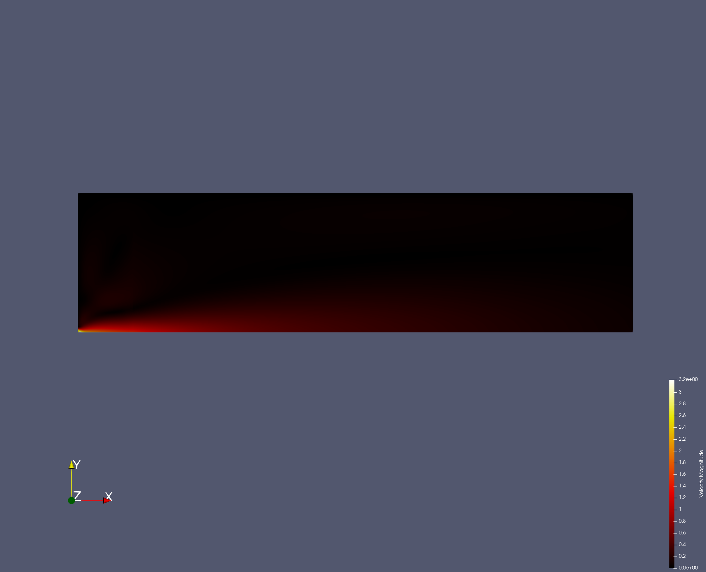
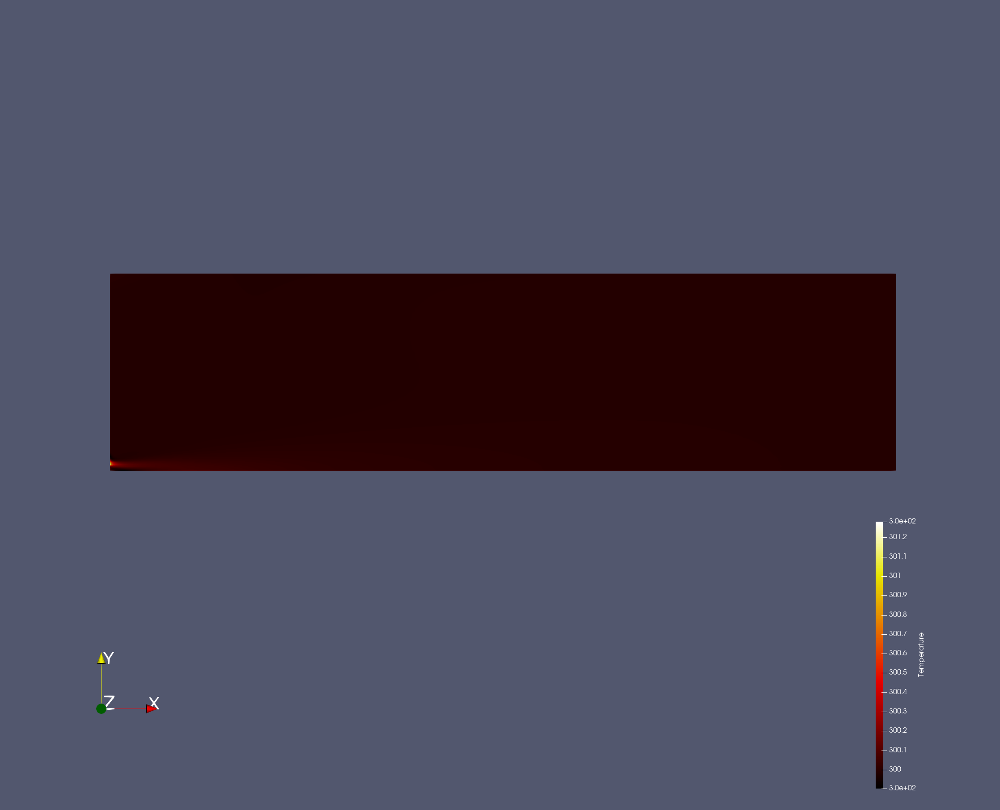
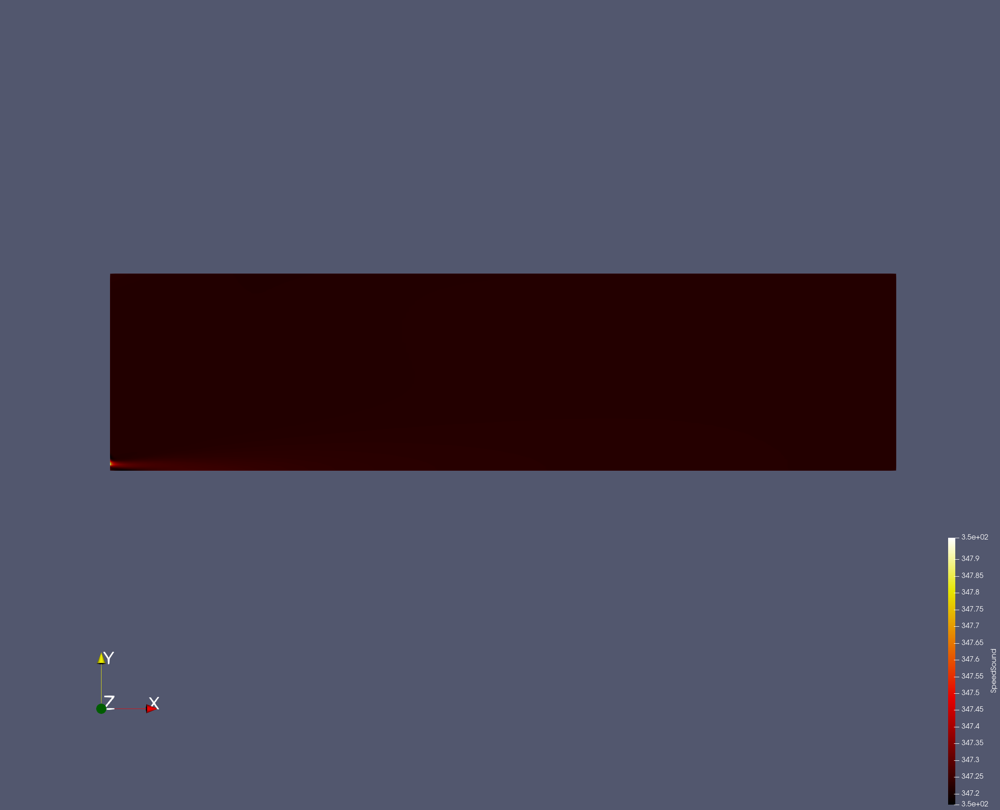

# Addition of new volume and screen output

## Introduction

In this test case we will be concerned with creating a new ouput field and also an output variable that can be outputted using the volume, screen and history output mechanisms.

The volume output will contain the spatial value of the field across the mesh cells.

The history and screen output will contain the area-averaged value of the variable across a certain marker that is specified by the user.

The quantity chosen is the local speed of sound.

## Approach for Volume Output

We will be implementing this capability only in the compressible solver as it makes sense to have a speed of sound variable there.

For that, we will be editing the CFlowCompOutput.cpp file which handles the output options of the compressible solvers. 

Here we can create a volume output field through the following function

```
AddVolumeOutput("SPEEDSOUND",  "SpeedSound", "PRIMITIVE", "Speed of Sound");
```

And we can assign a value to it using

```
SetVolumeOutputValue("SPEEDSOUND", iPoint, (Node_Flow->GetSoundSpeed(iPoint)));
````

Here Node_Flow contains the mesh information that can be obtained by calling the following function

```
const auto* Node_Flow = solver[FLOW_SOL]->GetNodes();
```

The value is assigned at every iPoint using the GetSoundSpeed function.

## Approach for History and Screen Output

This approach is a little bit more complicated. We will calculate the area averaged value of the speed of sound for a certain set of markers contained within the MARKER_ANALYZE list.

First we define the History Output 

```
/// DESCRIPTION: Speed of Sound Averaged over the Marker
AddHistoryOutput("AVG_SOUNDSPEED", "Avg_SoundSpeed", ScreenOutputFormat::FIXED, "RMS_RES", "Area Averaged Speed of Sound.", HistoryFieldType::RESIDUAL);
```

To set the value, we must first calculate the average speed over the marker.

For this, first we need to define some variables

```
const auto flow_nodes = solver[FLOW_SOL]->GetNodes();

  unsigned short iDim, iMarker, iMarker_Analyze;
  unsigned long iVertex, iPoint;

  const unsigned short nMarker      = config->GetnMarker_All();
  const unsigned short nDim         = geometry->GetnDim();
  const unsigned short nMarker_Analyze  = config->GetnMarker_Analyze();

  const bool axisymmetric               = config->GetAxisymmetric();

  vector<su2double> Surface_SoundSpeed (nMarker,0.0);
  vector<su2double> Surface_Area (nMarker,0.0);
  su2double  Tot_Surface_SoundSpeed  = 0.0;

  su2double Area, SoundSpeed, Vector[3];
```

Next a for loop is created that iterates over all the points of the Markers in the domain and adds them to the Surface_SoundSpeed variable multiplied by the area to store the summation of all sound speeds at each point in the marker.

We also calculate the Surface_Area variable at each marker

```
for (iMarker = 0; iMarker < nMarker; iMarker++) {

    if (config->GetMarker_All_Analyze(iMarker) == YES) {

      for (iVertex = 0; iVertex < geometry->nVertex[iMarker]; iVertex++) {

        iPoint = geometry->vertex[iMarker][iVertex]->GetNode();

        if (geometry->nodes->GetDomain(iPoint)) {

          geometry->vertex[iMarker][iVertex]->GetNormal(Vector);

          const su2double AxiFactor = GetAxiFactor(axisymmetric, *geometry->nodes, iPoint, iMarker);

          for (iDim = 0; iDim < nDim; iDim++) {
            Area += (Vector[iDim] * AxiFactor) * (Vector[iDim] * AxiFactor);
          }

          Area = sqrt(Area);

          SoundSpeed = flow_nodes->GetSoundSpeed(iPoint);

          Surface_SoundSpeed[iMarker] += SoundSpeed*abs(Area);
          Surface_Area[iMarker] += Area;
        }
      }
    }
  }
```

This value of the Area Multiplied total Sound Speed is then divided by the total surface area of the marker to give us the area averaged sound speed.

```
  for (iMarker_Analyze = 0; iMarker_Analyze < nMarker_Analyze; iMarker_Analyze++) {

    Surface_SoundSpeed_Total[iMarker_Analyze]  /= abs(Surface_Area_Total[iMarker_Analyze]);

  }
```

Which is then set using the following command

```
SetHistoryOutputValue("AVG_SOUNDSPEED", Tot_Surface_SoundSpeed);
```

## Results

We rerun the turbulent jet case but now with a compressible solver. The mesh is as follows.


- RED - Upper Wall - No Slip and Adiabatic
- GREEN - Left Wall - No Slip and Adiabatic
- BLUE - Inlet - Constant Velocity 
- YELLOW - Bottom Line - Symmetric Axis 
- PINK - Outlet - Atmospheric Pressure


The temperature is initialized to 300 K and does not change a lot throughout the simulation so we expect a value of around 345-350 m/s of the sound speed.

We will be analyzing the inlet marker. Hence the following setup in the config file is used.

```
MARKER_ANALYZE = (inlet)
```

The speed of sound should also be only dependent on the temperature profile.

As expected, the results match.







